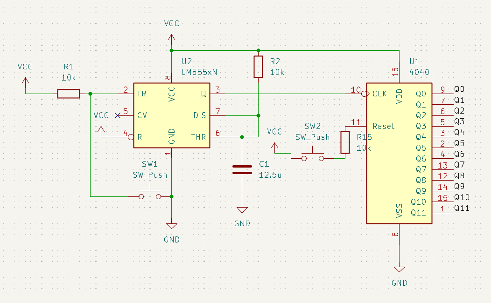
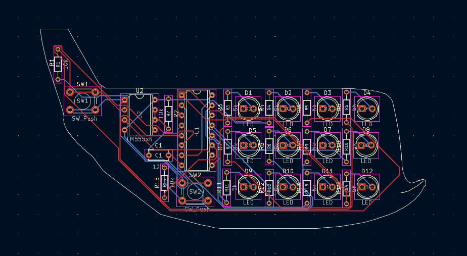

# Binary adder in an Airbus Beluga-shaped PCB

This is a simple binary adder in the form of an Airbus Beluga. It is a simple project for me to learn how to use ICs. This is for [Resolution Week 3](https://github.com/SwiftDust/Resolution) but a new rule states you can't use monorepos so that's why I made this separate repository.

I used the well-known 555 and CD4060 to make this PCB. I used the 555 in monostable mode with a time constant of 0.125 seconds. This is derived by the fact that the average person would click on a button no more than eight times in a second, so a time constant of 0.125 or lower is required. If we make the time constant too low, it may not be fed correctly into the 4060, so that is why I chose this value. The input of the 555 is wired to a button. The CLK input of the 4060 is then wired up with the output of the 555 and all the outputs are wired to LEDs. If the output of the 555 is high, the binary adder will add one number to the output. Additionally, I have added a "Reset" button wired to the RST input of the 4060, so people can reset the counter. I made this PCB for fun, but can be useful to learn to count in binary too!

## Schematic

## PCB design

